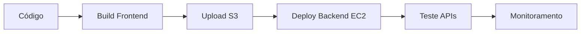

# 🚀 Deploy Automatizado - Gantt Project

Este projeto inclui scripts de automação para deploy na AWS de forma gratuita.

## 📋 Pré-requisitos

- ✅ Conta AWS (free tier)
- ✅ AWS CLI instalado e configurado
- ✅ Node.js e npm
- ✅ Git

## 🎯 Opções de Deploy

### 🚀 **Opção 1: Deploy Automático Completo (Recomendado)**

Cria toda infraestrutura AWS automaticamente:

```bash
# 1. Execute o script de inicialização
./scripts/init-aws.sh

# 2. Configure o banco de dados
./scripts/setup-rds.sh

# 3. Faça o deploy
./scripts/deploy.sh
```

### ⚙️ **Opção 2: Deploy Manual (Controle Total)**

Se preferir controlar cada etapa:

1. **Configure manualmente na AWS:**
   - RDS PostgreSQL
   - EC2 t2.micro
   - S3 bucket

2. **Configure o arquivo:**
   ```bash
   cp scripts/deploy.config.example scripts/deploy.config
   # Edite com seus valores
   ```

3. **Execute os scripts:**
   ```bash
   ./scripts/setup-rds.sh
   ./scripts/deploy.sh
   ```

## 📁 Scripts Disponíveis

| Script | Descrição |
|--------|-----------|
| `init-aws.sh` | 🏗️ Cria toda infraestrutura AWS |
| `setup-rds.sh` | 🗄️ Configura banco PostgreSQL |
| `deploy.sh` | 🚀 Deploy frontend + backend |
| `monitor.sh` | 📊 Monitora saúde da aplicação |

## 🔧 Configuração

### Arquivo `scripts/deploy.config`

```bash
# EC2 (Backend)
EC2_HOST="seu-ip-ec2"
EC2_USER="ec2-user"
EC2_KEY_PATH="/caminho/para/chave.pem"

# S3 (Frontend)
S3_BUCKET="seu-bucket"
AWS_REGION="us-east-1"

# RDS (Banco)
RDS_ENDPOINT="seu-rds.amazonaws.com"
RDS_PASSWORD="sua-senha"
```

## 📊 Monitoramento

### Verificação completa:
```bash
./scripts/monitor.sh
```

### Verificações específicas:
```bash
./scripts/monitor.sh health     # Verificação rápida
./scripts/monitor.sh resources  # Recursos do EC2
./scripts/monitor.sh logs       # Logs de erro
```

### Configurar alertas Slack (opcional):
```bash
# Adicione no deploy.config:
SLACK_WEBHOOK_URL="https://hooks.slack.com/services/..."
```

## 🔄 Workflow de Deploy



## 💰 Custos Estimados (Free Tier)

| Recurso | Custo/Mês | Free Tier |
|---------|-----------|-----------|
| EC2 t2.micro | $0 | ✅ 750h gratuitas |
| RDS db.t3.micro | $0 | ✅ 750h gratuitas |
| S3 | ~$1 | ✅ 5GB gratuitos |
| **Total** | **~$1** | |

## 🚨 Troubleshooting

### ❌ Erro de conectividade RDS
```bash
# Verificar Security Groups
aws ec2 describe-security-groups --group-ids sg-xxxxx

# Testar conectividade
telnet seu-rds-endpoint 5432
```

### ❌ EC2 não acessível
```bash
# Verificar status da instância
aws ec2 describe-instances --instance-ids i-xxxxx

# Verificar Security Group (porta 22 e 3001)
```

### ❌ Frontend não carrega
```bash
# Verificar bucket S3
aws s3 ls s3://seu-bucket

# Verificar configuração website
aws s3api get-bucket-website --bucket seu-bucket
```

## 🔧 Comandos Úteis

### SSH no EC2:
```bash
ssh -i sua-chave.pem ec2-user@seu-ip
```

### Logs do backend:
```bash
tail -f /home/ec2-user/gantt-project/backend/server.log
```

### Reiniciar backend:
```bash
pkill node
cd /home/ec2-user/gantt-project/backend
nohup npm start > server.log 2>&1 &
```

### Atualizar frontend:
```bash
npm run build
aws s3 sync build/ s3://seu-bucket --delete
```

## 🎯 URLs Finais

Após deploy bem-sucedido:

- **Frontend**: `http://seu-bucket.s3-website-us-east-1.amazonaws.com`
- **Backend**: `http://seu-ip-ec2:3001/api`
- **Banco**: `seu-rds-endpoint:5432`

## 🛡️ Segurança

### Recomendações:
- ✅ Use senhas fortes para RDS
- ✅ Restrinja Security Groups ao seu IP
- ✅ Configure CloudFront para HTTPS
- ✅ Monitore custos regularmente

### Variáveis sensíveis:
- RDS password ➜ Nunca commite no Git
- AWS keys ➜ Use IAM roles quando possível
- SSH keys ➜ Mantenha seguras

## 📞 Suporte

Em caso de problemas:

1. Verifique logs: `./scripts/monitor.sh logs`
2. Teste conectividade: `./scripts/monitor.sh health`
3. Verifique configuração: `cat scripts/deploy.config`

---

*Automatização criada para facilitar deploy na AWS. Monitore seus custos!* 💰