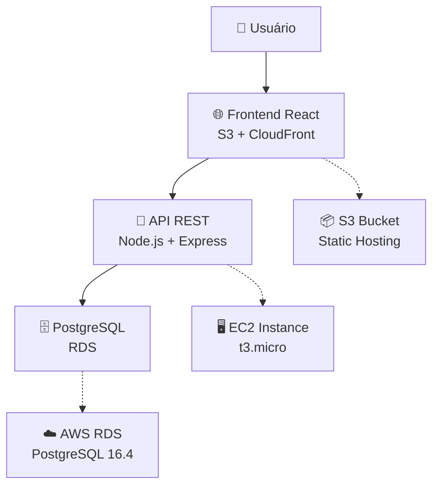

# 📊 Gantt Project Manager

> Uma aplicação moderna de gerenciamento de projetos com gráficos Gantt, desenvolvida com React e Node.js, deployada na AWS.

[](http://gantt-v2-frontend-20250716212001.s3-website-us-east-1.amazonaws.com)
[](https://reactjs.org/)
[](https://nodejs.org/)
[](https://postgresql.org/)

## 🎯 Funcionalidades

### 👥 **Gerenciamento de Usuários**
- Login por seleção de usuário
- Controle de permissões por proprietário de tarefa
- Visualização individual vs. equipe

### 📈 **Gráfico Gantt Interativo**
- Visualização em Dia, Semana ou Mês
- Arrastar e soltar tarefas
- Barras de progresso personalizáveis
- Cores customizáveis por tarefa

### ✏️ **CRUD Completo de Tarefas**
- ✅ Criar novas tarefas
- 📝 Editar tarefas existentes
- 🗑️ Excluir tarefas (apenas proprietário)
- 🎨 Personalizar cores
- 📊 Acompanhar progresso

### 🔐 **Segurança**
- Controle de acesso baseado em proprietário
- Políticas de Row Level Security (RLS) no banco
- Validação de permissões no backend

## 🚀 Demo ao Vivo

**🌐 Acesse a aplicação:** [Gantt Project Manager](http://gantt-v2-frontend-20250716212001.s3-website-us-east-1.amazonaws.com)

### 👤 Usuários de teste:
- João Victor
- João Gabriel  
- Victor Moreno
- Kaique Breno
- Lucas Queiroz

## 🏗️ Arquitetura



### 🛠️ **Stack Tecnológico**

| Camada | Tecnologia | Versão |
|--------|------------|--------|
| **Frontend** | React | 19.1.0 |
| **UI Components** | Bootstrap | 5.3.7 |
| **Gantt Chart** | Frappe Gantt | 1.0.3 |
| **Backend** | Node.js + Express | 18.20.2 |
| **Banco de Dados** | PostgreSQL | 16.4 |
| **Cloud** | AWS (EC2, RDS, S3) | - |

## 🔧 Configuração Local

### Pré-requisitos
- Node.js 18+ 
- PostgreSQL 15+
- Git

### 📥 Instalação

```bash
# 1. Clone o repositório
git clone https://github.com/jvtesteves/gantt-project.git
cd gantt-project

# 2. Configure o backend
cd backend
npm install

# Crie arquivo .env
cat > .env << EOF
DB_HOST=localhost
DB_PORT=5432
DB_NAME=gantt_project
DB_USER=postgres
DB_PASSWORD=sua_senha
NODE_ENV=development
PORT=3001
FRONTEND_URL=http://localhost:3000
EOF

# 3. Configure o banco
psql -U postgres -c "CREATE DATABASE gantt_project;"
psql -U postgres -d gantt_project -f ../setup.sql

# 4. Inicie o backend
npm start

# 5. Configure o frontend (nova aba do terminal)
cd ../
npm install

# Crie arquivo .env
echo "REACT_APP_API_URL=http://localhost:3001/api" > .env

# 6. Inicie o frontend
npm start
```

A aplicação estará disponível em `http://localhost:3000`

## ☁️ Deploy na AWS

### 🚀 Deploy Automático (Recomendado)

```bash
# 1. Configure AWS CLI
aws configure

# 2. Execute script de inicialização
./scripts/init-aws.sh

# 3. Configure banco de dados
./scripts/setup-rds.sh

# 4. Faça deploy da aplicação
./scripts/deploy.sh
```

### 📊 Monitoramento

```bash
# Verificação completa de saúde
./scripts/monitor.sh

# Verificação rápida
./scripts/monitor.sh health

# Logs de erro
./scripts/monitor.sh logs
```

### 💰 Custos Estimados (Free Tier)

| Recurso | Tipo | Custo/Mês |
|---------|------|-----------|
| EC2 | t3.micro | $0 (750h gratuitas) |
| RDS | db.t3.micro | $0 (750h gratuitas) |
| S3 | Standard | ~$1 (5GB gratuitos) |
| **Total** | | **~$1/mês** |

## 📁 Estrutura do Projeto

```
gantt-project/
├── 📁 backend/                 # Servidor Node.js
│   ├── server.js              # Arquivo principal
│   ├── package.json           # Dependências
│   └── .env                   # Variáveis de ambiente
├── 📁 src/                    # Frontend React
│   ├── App.js                 # Componente principal
│   ├── App.css                # Estilos
│   └── index.js               # Entry point
├── 📁 scripts/                # Scripts de automação
│   ├── init-aws.sh            # Criar infraestrutura
│   ├── deploy.sh              # Deploy da aplicação
│   ├── setup-rds.sh           # Setup do banco
│   └── monitor.sh             # Monitoramento
├── 📄 setup.sql               # Schema do banco
├── 📄 DEPLOY.md               # Guia de deploy
└── 📄 README.md               # Este arquivo
```

## 🔗 URLs e Endpoints

### 🌐 **Produção (AWS)**
- **Frontend**: http://gantt-v2-frontend-20250716212001.s3-website-us-east-1.amazonaws.com
- **API Base**: http://3.84.186.30:3001/api

### 📡 **Endpoints da API**
| Método | Endpoint | Descrição |
|--------|----------|-----------|
| `GET` | `/api/users` | Lista usuários |
| `GET` | `/api/tasks` | Lista todas as tarefas |
| `POST` | `/api/tasks` | Cria nova tarefa |
| `PUT` | `/api/tasks/:id` | Atualiza tarefa |
| `DELETE` | `/api/tasks/:id` | Remove tarefa |

## 🧪 Testes

```bash
# Testar API
curl http://3.84.186.30:3001/api/users

# Testar conectividade do banco
./scripts/monitor.sh health

# Verificar logs
./scripts/monitor.sh logs
```

## 🔒 Segurança

### 🛡️ **Implementado**
- ✅ Row Level Security (RLS) no PostgreSQL
- ✅ Validação de proprietário nas operações CRUD
- ✅ Sanitização de inputs
- ✅ CORS configurado adequadamente
- ✅ SSL/TLS para conexões com RDS

### 🚨 **Recomendações**
- 🔑 Usar senhas fortes para RDS
- 🌐 Configurar CloudFront para HTTPS
- 🔐 Restringir Security Groups por IP
- 💰 Monitorar custos AWS regularmente

## 🤝 Contribuição

1. Fork o projeto
2. Crie uma branch: `git checkout -b feature/nova-funcionalidade`
3. Commit: `git commit -m 'Adiciona nova funcionalidade'`
4. Push: `git push origin feature/nova-funcionalidade`
5. Abra um Pull Request

## 📝 Licença

Este projeto está sob a licença MIT. Veja [LICENSE](LICENSE) para mais detalhes.

## 👥 Equipe

**RPA Gogroup**
- [João Victor](https://github.com/jvtesteves) - Desenvolvedor Principal

---

## 📞 Suporte

Encontrou um problema? 

1. ✅ Verifique a [documentação de deploy](DEPLOY.md)
2. 🔍 Execute `./scripts/monitor.sh` para diagnóstico
3. 🐛 Abra uma [issue](https://github.com/jvtesteves/gantt-project/issues)

---

<div align="center">

**⭐ Se este projeto te ajudou, considere dar uma estrela!**

[](./DEPLOY.md)
[](http://gantt-v2-frontend-20250716212001.s3-website-us-east-1.amazonaws.com)

</div>